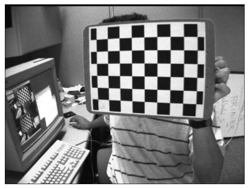
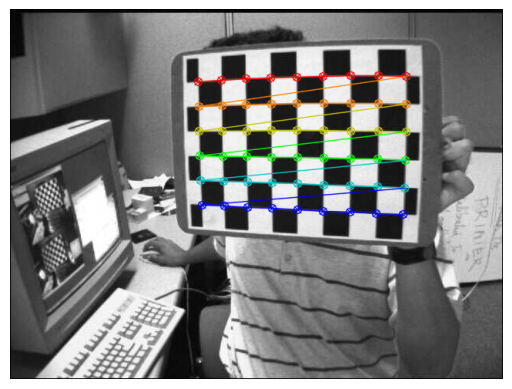

# PnP Camera Pose Estimation

This project implements a complete camera calibration and 3D pose estimation pipeline using OpenCV. It detects chessboard corners, estimates camera parameters, solves the Perspective-n-Point (PnP) problem, and visualizes the camera pose in 3D.

---

## Project Overview

The goal of this project is to estimate the 3D position and orientation of a camera from a set of 2D chessboard images using classical computer vision techniques.

The pipeline includes:
- Feature detection (chessboard corners)
- Camera calibration
- Pose estimation using PnP
- Visualization of 3D coordinate axes

---

## Methodology

1. Detect chessboard corners in input images  
2. Refine detected points using sub-pixel accuracy  
3. Estimate camera intrinsic parameters using multiple views  
4. Solve the PnP problem to obtain rotation and translation  
5. Project 3D axes onto the image  
6. Validate results using reprojection error  

---

## Results

### Input Image

### Detected Chessboard Corners

### Camera Pose Visualization

---

## Output

- Camera intrinsic matrix (K)
- Rotation vector (rvec)
- Translation vector (tvec)
- Reprojection error
- 3D axis projection on image

## Author
Aya Kheir Beq MSc in Mechatronics Engineering Focus: Computer Vision, Robotics, Intelligent Systems
